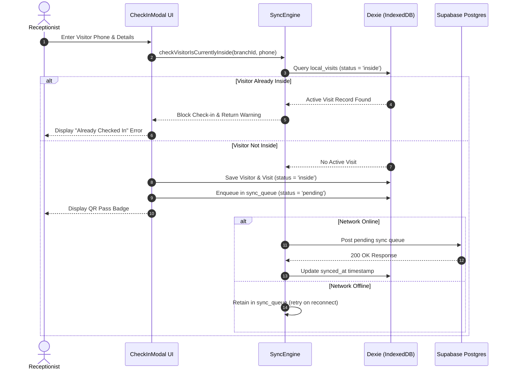

# VMS System Architecture Specification

This document details the architectural principles, data flows, offline-first mechanisms, security models, and deployment pipeline for the Centralised Visitor Management System (VMS).

---

## 1. Multi-Tenant Architectural Model

```
                    ┌─────────────────────────────────────────┐
                    │      Vidyavahini Group Platform         │
                    │           (Super Admin)                 │
                    └───────────────────┬─────────────────────┘
                                        │
             ┌──────────────────────────┴──────────────────────────┐
             ▼                                                     ▼
┌──────────────────────────┐                         ┌──────────────────────────┐
│   VIMTECH College        │                         │  BBA Institute College   │
│   (Master Admin)         │                         │  (Master Admin)          │
└────────────┬─────────────┘                         └────────────┬─────────────┘
             │                                                    │
     ┌───────┴───────┐                                            │
     ▼               ▼                                            ▼
┌─────────┐     ┌─────────┐                                  ┌─────────┐
│ Main    │     │ City    │                                  │ Koram.  │
│ Campus  │     │ Campus  │                                  │ Campus  │
└─────────┘     └─────────┘                                  └─────────┘
```

- **Super Admin** (`role = 'super_admin'`) = Platform owner account (Vidyavahini Group). Single platform-wide account.
- **Master Admin** (`role = 'master_admin'`) = College administrator account (one per college).
- **Branch Principal** (`role = 'branch_principal'`) = Campus principal account (one per branch).
- **Receptionist** (`role = 'receptionist'`) = Front-desk operator (one or more per branch).
- **Tenant Isolation**: Enforced strictly at the database level using Supabase Row Level Security (RLS). Every query automatically includes scope checks derived from the user's authenticated `profiles` record.

---

## 2. Auto-Provisioning Flow

When a Super Admin onboards a new college tenant, the system atomically provisions:
1. **College Record**: Name, display name, tagline, address, contact details.
2. **Default Branch**: Primary campus branch location.
3. **Three Credentials**:
   - `Master Admin`: `{code}.masteradmin`
   - `Branch Principal`: `{code}.principal`
   - `Receptionist`: `{code}.reception1`
   - Password set to `{DisplayName}@2026` with `must_change_password = true`.

---

## 3. Offline-First Architecture & Sync Engine

Front desks cannot halt operations when network connectivity fluctuates. Every check-in/out write succeeds locally first using Dexie.js (IndexedDB wrapper) before synchronizing to the cloud.



### Key Principles:
1. **Local-First Writes**: Writes land in IndexedDB (`local_visits`, `local_visitors`) instantaneously.
2. **On-Device Deduplication**: `checkVisitorIsCurrentlyInside` checks `local_visits` cache directly on the device. Prevents duplicate active check-ins even with 0% network connectivity.
3. **Queue Reconnection**: Window `online` event listener triggers automatic sync retries with exponential backoff.

---

## 4. QR Token Security Specification

- **Token Format**: `VMS-{COLLEGE_TAG}-{4DIGIT_RANDOM}-{TIMESTAMP_SUFFIX}` (e.g., `VMS-VIMTECH-8923-9481`).
- **Single-Use Enforcement**:
  - `qr_used` boolean flag defaults to `false` on check-in.
  - Scanner checkout sets `qr_used = true` and `status = 'checked_out'`.
  - Re-scanning an already-used QR token is rejected with explicit error message.
- **Expiration Timestamp (`qr_expires_at`)**:
  - Expiration set to 11:59 PM on operating day. Scans after expiration force manual fallback check-out.

---

## 5. Single Shared Android APK & Generic Platform Model

- **Package Identifier**: `in.vidyavahini.vms`
- **Application Name**: `Vidyavahini VMS`
- **Identity Scope**: College logo, name, and address are used exclusively for visitor pass badge rendering and PDF report headers. The web UI and Android app shell remain generic across all institutions.
